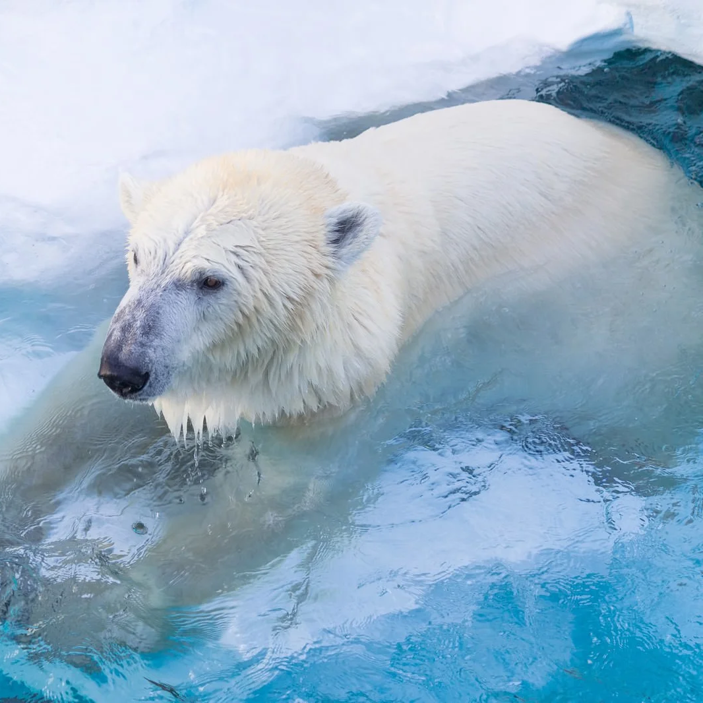

+++
title = 'Polars tips'
date = 2024-01-21T01:11:48+09:00
draft = false
tags = ['polars']
+++
<!-- 

cover2.jpg
 -->
<!--  -->
### Print DataFrame without omitting


with pl.Config(tbl_rows=1, tbl_cols=100):
    print(df1)
    print(df2)



with pl.Config(tbl_rows=1, tbl_cols=100):
   print(df)



df = df.unique(subset=["datetime"])


polars
polars
polars
polars

polarspolars
polars
polars
polars
polars
polars
