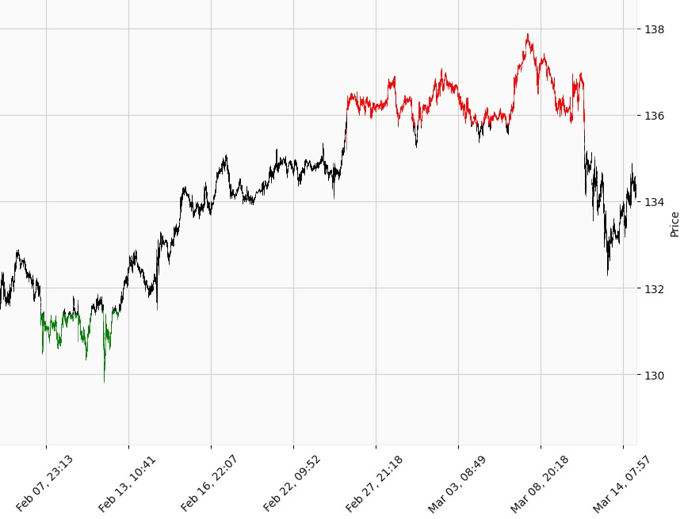

+++
title = 'Mplfinance tips'
date = 2024-02-01T00:00:48+09:00
draft = false
tags = ['matplotlib', 'finance']
+++
 
### Plotting Financial Data with Market Color Overrides

import polars as pl
import mplfinance as mpf

df = pl.read_csv("df.csv", try_parse_dates=True)
df = df.to_pandas()
df = df.set_index("datetime")

# Plot the data without market color overrides
mpf.plot(df,volume=False,type='candle',style='yahoo',figscale=1.4)

# Initialize the MCOverrides column with the base market colors (black and white)
mc = mpf.make_marketcolors(base_mpf_style='classic')

# Get the target column
target = df["target"]

# Initialize the column with all values set to `mc`
df['MCOverrides'] = [mc] * len(df)

# Override the market colors based on the target value
df.loc[target > 1000, 'MCOverrides'] = 'green'
df.loc[target < -1000, 'MCOverrides'] = 'red'

# Plot the data with market color overrides
mco = df['MCOverrides'].values
mpf.plot(df,volume=False,type='candle',style='yahoo',marketcolor_overrides=mco,figscale=1.4)

output image
